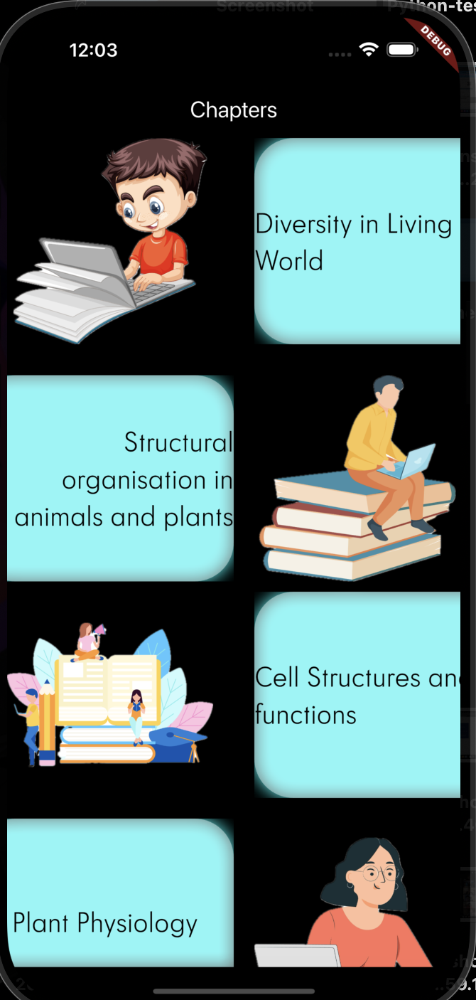
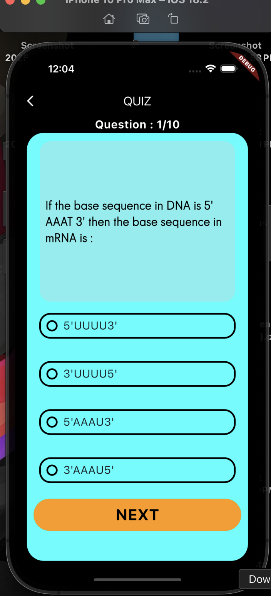
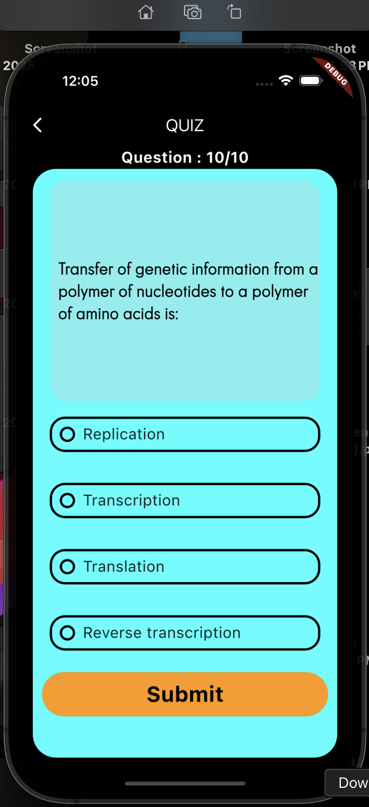
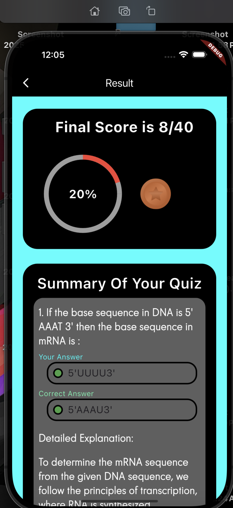
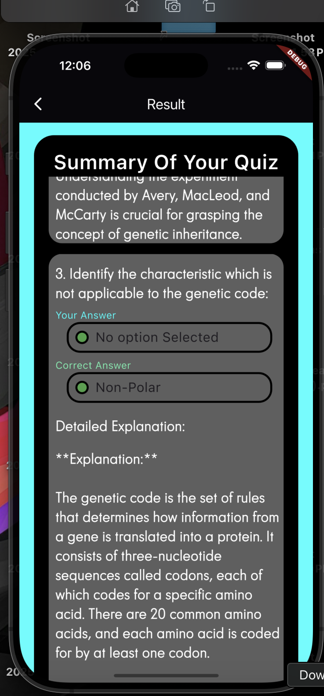

# 📚 Quiz App

## 📝 Overview
This **Quiz App** is a Flutter-based application designed to deliver an interactive and user-friendly quiz experience. Built with **Bloc** for state management, the app provides a seamless and efficient flow of data and UI updates.

---

## ✨ Features

- **State Management**: Powered by **Bloc** for clean and scalable state management.
- **User-Friendly UI**: Simple, intuitive, and responsive interface for users.
- **Score and Percentage**: At the end of the quiz, displays the total score along with the percentage of marks scored using a **circular progress bar**.
- **Quiz Summary**:
  - Highlights the selected answers by the user.
  - Displays the correct answers.
  - Provides detailed explanations for correct answers fetched from an **API**.

---

## 📷 Screenshots


1. **Home Screen**  
   


2. **Question Screen**  
   

   
3. **Submit Screen**  
   


4. **Score and Summary**  
  

5. **Detailed Summary**
   

---

## 🚀 Getting Started

### Prerequisites
- Flutter SDK installed.
- Basic knowledge of Flutter development.

### Installation
1. Clone this repository:
   ```bash
   git clone https://github.com/Abhay-Kumar-Dubey/quiz-app.git
2. Navigate to the project directory:
   ```bash
    cd quiz-app
3. Get the dependencies:
   ```bash
    flutter pub get
4. Run the app:
   ```bash
    flutter run
## 🛠️ Tech Stack

*  Flutter: Frontend framework.
*  Dart: Programming language.
*  Bloc: State management.
*  API Integration: Fetches quiz data and explanations dynamically.

## 🌟 Highlights

### Circular Progress Bar: Displays the percentage of marks scored.
### Quiz Summary: Gives users detailed feedback on their performance.
### Smooth State Management: Ensures efficient UI updates without glitches.
